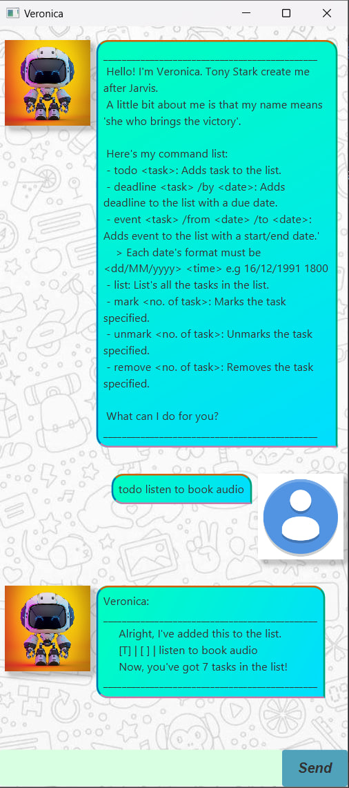

# Veronica User Guide

## Introduction
Veronica is a task management assistant designed to help users organize their tasks efficiently. With Veronica, you can add different types of tasks, mark them as complete or incomplete, remove them, find specific tasks, and even sort them by type and date.



## Features

### Adding a To-Do Task
To add a simple to-do task:

Example: `todo Buy groceries`

**Expected outcome:**
```
Veronica:
______________________________________________
Alright, I've added this to the list.
[T] | [ ] | Buy groceries
Now, you've got 1 task in the list!
______________________________________________
```

### Adding a Deadline Task
To add a task with a deadline:

Example: `deadline Submit assignment /by 16/12/1991 2359`

**Expected outcome:**
```
Veronica:
______________________________________________
Alright, I've added this to the list.
[D] | [ ] | Submit assignment | [by: 16 Dec 1991, 11:59pm]
Now, you've got 2 tasks in the list!
______________________________________________
```

### Adding an Event Task
To add an event with a start and end time:

Example: `event Project meeting /from 20/12/2025 1400 /to 20/12/2025 1600`

**Expected outcome:**
```
Veronica:
______________________________________________
Alright, I've added this to the list.
[E] | [ ] | Project meeting | [from: 20 Dec 2025, 2:00pm | to: 20 Dec 2025, 4:00pm]
Now, you've got 3 tasks in the list!
______________________________________________
```

### Listing Tasks
To display all tasks currently in the system, sorted in the following order: **To-Do → Deadline (by due date) → Event (by start date):**


Example: `list`

**Expected outcome:**
```
Veronica: List of current tasks
______________________________________________
1. [T] | [ ] | Buy groceries
2. [D] | [ ] | Submit assignment | [by: 16 Dec 1991, 11:59pm]
3. [E] | [ ] | Project meeting | [from: 20 Dec 2025, 2:00pm | to: 20 Dec 2025, 4:00pm]
______________________________________________
```

### Marking a Task as Complete
To mark a task as completed:

Example: `mark 2`

**Expected outcome:**
```
Veronica:
______________________________________________
Great job! Marking this task as completed!
[D] | [X] | Submit assignment | [by: 16 Dec 1991, 11:59pm]
______________________________________________
```

### Marking a Task as Incomplete
To undo completion of a task:

Example: `unmark 2`

**Expected outcome:**
```
Veronica:
______________________________________________
Alright! Marking this task as uncompleted!
[D] | [ ] | Submit assignment | [by: 16 Dec 1991, 11:59pm]
______________________________________________
```

### Finding a Task
To search for tasks by keyword:

Example: `find assignment`

**Expected outcome:**
```
Veronica:
______________________________________________
Showing all task with the keyword: 
1. [D] | [ ] | Submit assignment | [by: 16 Dec 1991, 11:59pm]
______________________________________________
```

### Removing a Task
To remove a specific task:

Example: `remove 1`

**Expected outcome:**
```
Veronica:
______________________________________________
Removed [T] | [ ] Buy groceries
Now, you've have 2 tasks in the list.
______________________________________________
```

To remove all tasks:

Example: `remove all`

**Expected outcome:**
```
Veronica:
______________________________________________
Removed all the tasks in this list.
______________________________________________
```

### Exiting the Program
To save tasks and exit Veronica:

Example: `bye`

**Expected outcome:**
```
Veronica: Bye. Hope to see you again soon!
```

